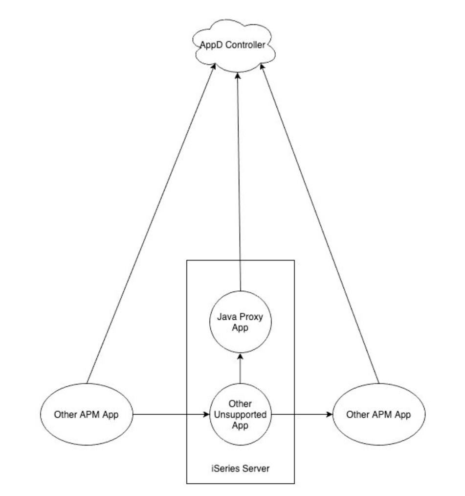
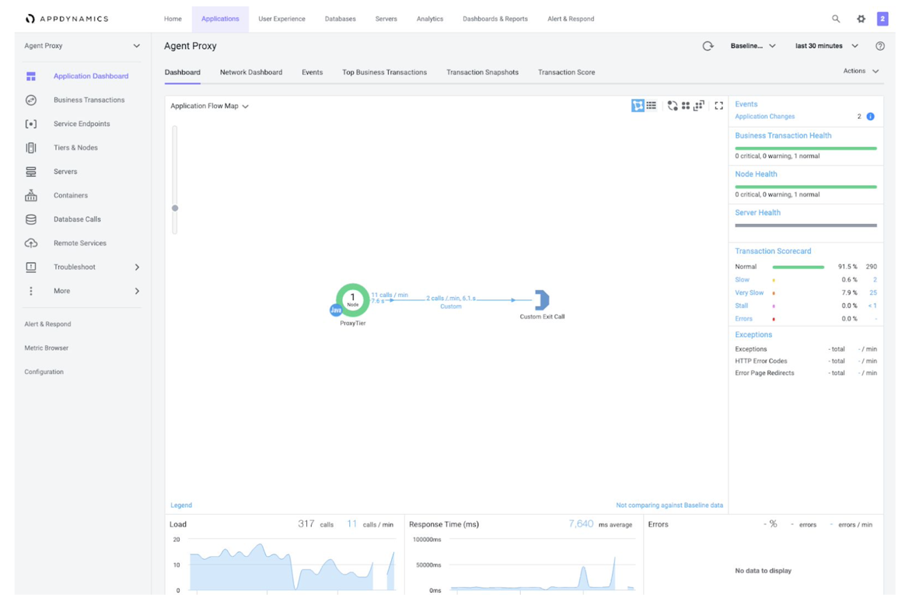

# Proxy AppDynamics Agent

## Description and Requirements ##

Solution to a customer needing to instrument a legacy application running in a language or environment currently unsupported by AppDynamics. Basically, we would install a small application running on either the same machine or relatively nearby that the legacy application can message with using any supported protocol to request agent operations on its behalf. In essence this is how many of our agents supporting python and other languages work. The difference here is that we haven’t come across the legacy application technology enough to justify an internal engineering effort or long term support. In the diagram below we call this component the “Java Proxy App” but it could also be written using our C/C++ Native agent or .Net agent depending on the platform and customer requirements. Using the Java Agent as an example for this explanation, and favoring it because of iSDK supportability and simplicity of development and deployment, it is the best example choice.

In this diagram the “Other APM App” is any upstream or downstream application already supported by AppDynamics that could potentially be sending requests to or receiving requests from the “Other Unsupported App”, these applications will send correlation headers as per the backend protocol used and require the developers of the “Other Unsupported App” to retrieve those correlation strings and forward them on to the next downstream “Other APM App” as well. Any Business Transaction started, or continued, will need to be done by making a call to the “Java Proxy App” which will have a Java APM Agent running to support creating the same within AppDynamics.
The Java Proxy App will need to be written to receive messages from the “Other Unsupported App” using any native protocol that is supported. It should have an interface to allow translation from those calls to the AppDynamics iSDK for the following functions:
1. Start Business Transaction - To begin a BT within appdynamics on the application, tier, and node configured by the Java Proxy App APM Agent, just as any other supported application would. The only caveat being that this BT should be a Custom BT, unless enough details can be provided to
   consistently start a Servlet based BT, or it makes sense to set the type to Java POJO. This request
   should translate to ensure a call to
   “Transaction AppdynamicsAgent.startTransaction( String btName, String correlationHeader = upstream
   correlation id if known, String btType = null for Custom, boolean isAsync = false )”
   This call should return the unique identifier of the business transaction for future lookups to end the
   transaction as well as perform any other actions on the same. This unique identifier can be retrieved
   by a call to the created transactions method, for the same. “String Transaction.getUniqueIdentifier()” All subsequent calls to work with the newly created Business Transaction will need to first call
   “Transaction AppdynamicsAgent.getTransaction( String uniqueTransactionIdentifier )” in order to work
   with it.
2. End Business Transaction - To end a started business transaction, first retrieve it with the supplied
   unique identifier and then simply call “Transaction.end()” to mark it completed. Optionally, a call to “Transaction.markAsError( String errorMessage )” will be required to mark the transaction as failed and send any optionally collected Snapshot Data to the AppDynamics controller.
3. Collect Data - To collect Snapshot and Analytics data for a particular transaction, Analytics data will be sent directly to the controller, but Snapshot data will only be sent in the event of either an error, health rule violation, or periodic collection trigger. Again, the Transaction Unique Identifier is needed in order to send the data to the controller associated with a particular transaction. The API call is “Transaction.collectData( String key, String value, Set<DataScope> dataScopes)”
   The Set of DataScopes needs to be build to be inclusive of at least one DataScope.SNAPSHOTS, and DataScope.ANALYTICS. Snapshot data will be displayed in transaction snapshots and is meant mainly for troubleshooting or quality assurance. Analytics data will be searchable within the Business IQ toolset and available to create searches, metrics, and dashboards.
4. Start an Exitcall and End and Exitcall - To allow a legacy application to track and correlate an exitcall to another downstream application that may or may not have an appdynamics agent monitoring.
5. Publish Event - To send an event to the controller documenting either an informative, warning, or error event for capture and possible action, it is recommended to create a mechanism to send semi formatted notifications to the controller using the iSDK publisher, this does not require a transaction and can be sent with relatively few specifications. The API call is “AppdynamicsAgent.getEventPublisher().publishEvent( String eventSummary, String severity = INFO WARN or ERROR, String eventType, Map<String,String> details<Key,Value>)
   
    Event types are one of ERROR, APPLICATION_ERROR, APPLICATION_INFO, STALL, BT_SLA_VIOLATION, DEADLOCK, MEMORY_LEAK, MEMORY_LEAK_DIAGNOSTICS, LOW_HEAP_MEMORY, ALERT, CUSTOM, APP_SERVER_RESTART, BT_SLOW, SYSTEM_LOG, INFO_INSTRUMENTATION_VISIBILITY, AGENT_EVENT, INFO_BT_SNAPSHOT, AGENT_STATUS, SERIES_SLOW, SERIES_ERROR, ACTIVITY_TRACE, OBJECT_CONTENT_SUMMARY, DIAGNOSTIC_SESSION, HIGH_END_TO_END_LATENCY, APPLICATION_CONFIG_CHANGE, APPLICATION_DEPLOYMENT, AGENT_DIAGNOSTICS, MEMORY, LICENSE, CONTROLLER_AGENT_VERSION_INCOMPATIBILITY, CONTROLLER_EVENT_UPLOAD_LIMIT_REACHED, CONTROLLER_RSD_UPLOAD_LIMIT_REACHED, CONTROLLER_METRIC_REG_LIMIT_REACHED, CONTROLLER_ERROR_ADD_REG_LIMIT_REACHED, CONTROLLER_ASYNC_ADD_REG_LIMIT_REACHED, AGENT_METRIC_REG_LIMIT_REACHED, AGENT_ADD_BLACKLIST_REG_LIMIT_REACHED, AGENT_ASYNC_ADD_REG_LIMIT_REACHED, AGENT_ERROR_ADD_REG_LIMIT_REACHED,
AGENT_METRIC_BLACKLIST_REG_LIMIT_REACHED, DISK_SPACE, INTERNAL_UI_EVENT, APPDYNAMICS_DATA, APPDYNAMICS_INTERNAL_DIAGNOSTICS, APPDYNAMICS_CONFIGURATION_WARNINGS, AZURE_AUTO_SCALING, POLICY_OPEN, POLICY_OPEN_WARNING, POLICY_OPEN_CRITICAL, POLICY_CLOSE, POLICY_UPGRADED, POLICY_DOWNGRADED, RESOURCE_POOL_LIMIT, THREAD_DUMP_ACTION_STARTED, EUM_CLOUD_BROWSER_EVENT, THREAD_DUMP_ACTION_END, THREAD_DUMP_ACTION_FAILED, RUN_LOCAL_SCRIPT_ACTION_STARTED, RUN_LOCAL_SCRIPT_ACTION_END, RUN_LOCAL_SCRIPT_ACTION_FAILED, RUNBOOK_DIAGNOSTIC_SESSION_STARTED, RUNBOOK_DIAGNOSTIC_SESSION_END, RUNBOOK_DIAGNOSTIC_SESSION_FAILED, CUSTOM_ACTION_STARTED, CUSTOM_ACTION_END, CUSTOM_ACTION_FAILED, WORKFLOW_ACTION_STARTED, WORKFLOW_ACTION_END, WORKFLOW_ACTION_FAILED, NORMAL, SLOW, VERY_SLOW, BUSINESS_ERROR, ALREADY_ADJUDICATED, ADJUDICATION_CANCELLED, EMAIL_SENT, SMS_SENT
6. Report Metric - To send custom metrics to the controller a mechanism should be implemented to forward any custom metrics to the controller. It is recommended to write this handler to support multiple metrics at a time, even though the API call only handles one metric, it is trivial to loop through a list and publish. The iSDK call is “AppdynamicsAgent.getMetricPublisher.reportMetric( String metricName = “Pipe|Delimited|Name”, long metricValue, String aggregationType = [AVERAGE, SUM, OBSERVATION], String timeRollupType [AVERAGE, SUM, CURRENT], String clusterRollupType = [INDIVIDUAL, COLLECTIVE] )”

Additional capabilities can be supported to include starting Service Endpoints. All can be added as appropriate or needed. AppDynamics Professional Services can assist in the creation of this in consultation with the Customer’s Application Development team.

## Benefits of using this solution ##

Though other techniques do exist to publish data into AppDynamics using a Machine Agent Extension to populate statistics in regards to performance of unsupported applications, those techniques do not illustrate the transaction execution within the flowmap of the application. The technique outlined here allows for each transaction to seamlessly continue from one supported platform to another through the proxy agent mechanism.

Data for a particular transaction can be sent to AppDynamics and displayed within snapshots as well as analytics data, just as other supported platforms.

# Howto
1. install an appdynamics java apm agent and configure it to connect to your controller, as usual
2. configure the proxy agent app to listen for requests, as you like by editing config.properties
3. run the proxy agent with something like: java -javaagent:appdAgent/javaagent.jar -Xmx256m -jar ProxyAgent-1.0.jar config.properties
4. make requests to the proxy, feel free to play with the included perl module and example perl script: AppDynamicsProxyAgent.pm and btTest.pl

# Open an issue if something isn't working as you expect :)

## References: ##
* Java iSDK Javadocs - ​https://sdkdocs.appdynamics.com/javadocs/java-agent-api/v4.5/
* AppDynamics iSDK published documentation - https://docs.appdynamics.com/display/PRO45/Java+Agent+API+User+Guide